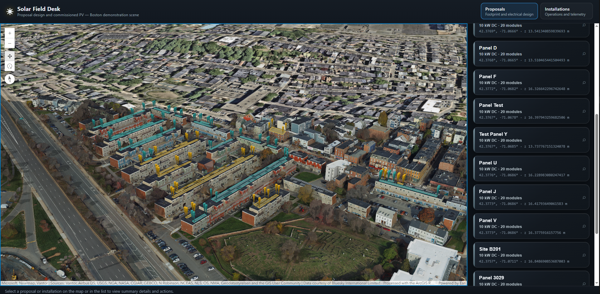
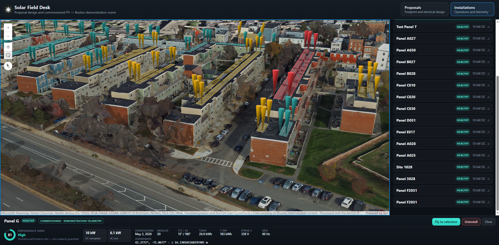
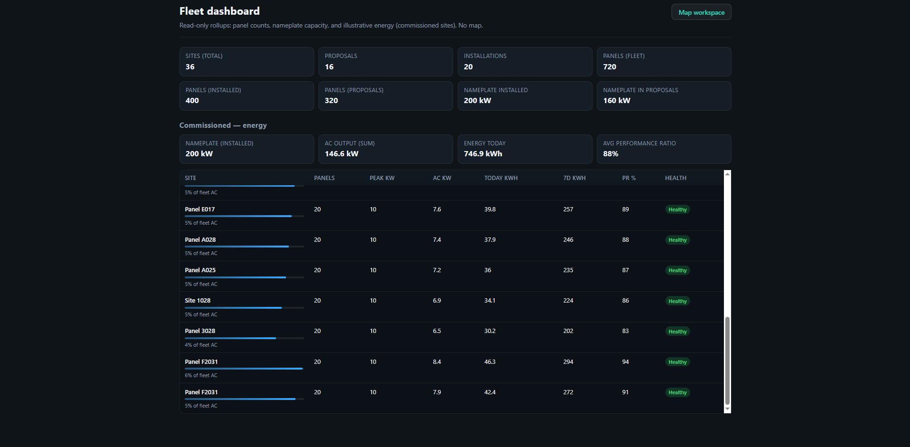

# Solar Field Desk

Angular 19 SPA for solar site management: map workspace (proposals and installations), fleet dashboard, and **`SiteService`** REST calls to **`/sites`**. This package is frontend-only—no bundled backend or seed data; provide an API that implements the routes below.

## Screenshots

Map workspace — **Proposals** tab, 3D scene with PV footprints and proposal list.



Map workspace — **Installations** tab, list with health badges and selection footer for a commissioned site.



**Fleet dashboard** — read-only KPIs, commissioned energy rollups, and per-site table (no map).



## API expectations

- **Development (`ng serve`)**: `SiteService` uses `http://localhost:3001/sites`. Backend should expose `GET/POST /sites` and `GET/PATCH/DELETE /sites/:id` (json-server-style), with CORS if the API is on another origin.
- **Production**: `src/environments/environment.ts` → `environment.apiBase` plus `/sites` (default `apiBase` is `/api`, so `/api/sites` on the app host). Adjust `apiBase` or use a reverse proxy as needed.

## Run the UI

```bash
npm start
```

Open `http://localhost:4200/` (map) or `http://localhost:4200/dashboard`. If the API is unreachable, an error banner shows until requests succeed.

## Build

```bash
npm run build
```

Output: `dist/gis-solar-panel-management`.

## Tests

```bash
npm test
```

## CLI

[Angular CLI documentation](https://angular.dev/tools/cli).
